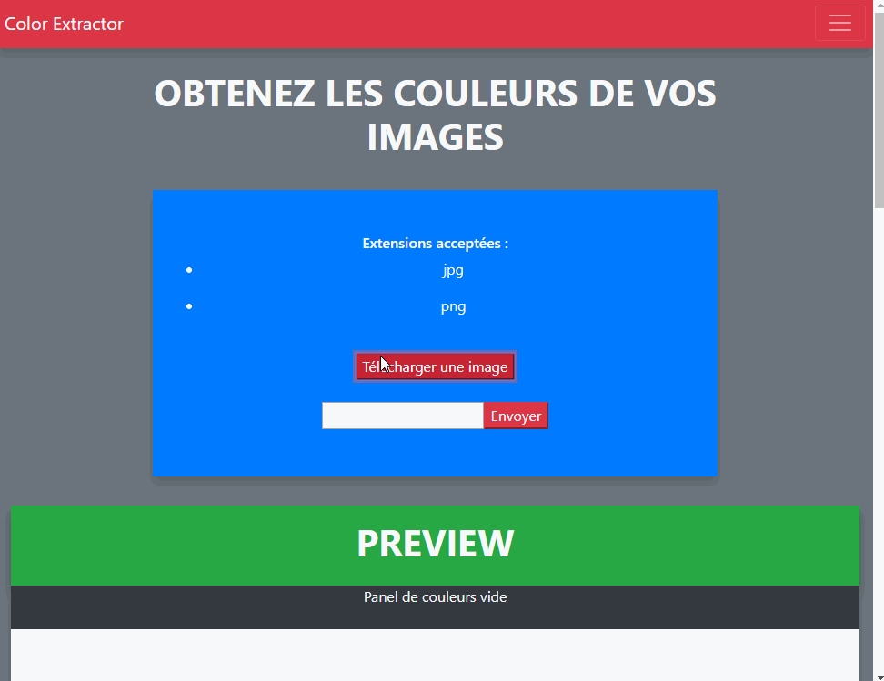

# Cordova Image Color
First attempt to put a webapp to android by Cordova.
Made with JavaScript ES3, then we remade it with ES6 and JQuery.
We used Imagga for the API service, and Bootstrap for the layout. 

[Git page](https://socalloff.github.io/Image-Color-Cordova/www/)

